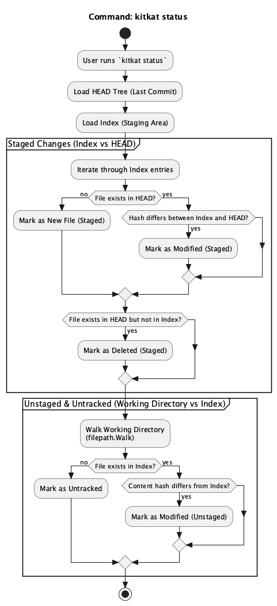
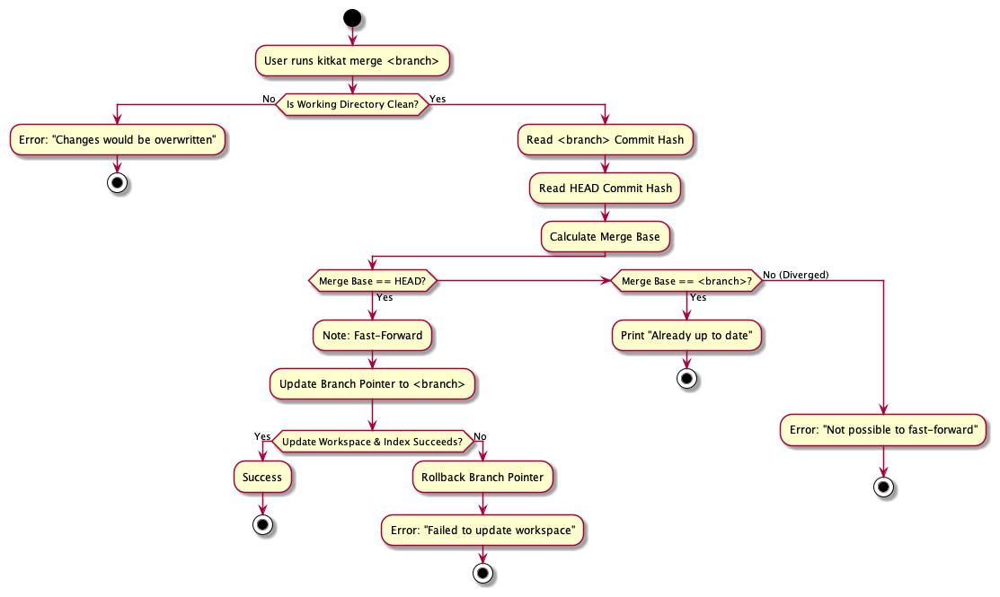

## 1. Repository Initialization

Logic for creating a new repository structure (`.kitcat` folders, HEAD, etc.).

## 2. Staging Flow (Add)

The following activity diagram explains how the `kitcat add` command stages files
into the index, including both individual paths and the `--all` flag.

## 3. Snapshot Flow (Commit)

Logic for creating a permanent snapshot from the Index.

## Status Command

The `kitcat status` command determines the state of files by comparing
three trees: the HEAD commit, the Index (staging area), and the Working
Directory.

The process is split into two phases:

1. Detecting staged changes by comparing the Index against HEAD.
2. Detecting unstaged and untracked changes by comparing the Working
   Directory against the Index.

## Branch Command

Logic for listing and creating branches.

## Merge — Fast-forward

The following diagram illustrates kitcat's fast-forward merge behavior. It shows the command entry point, the dirty working-directory check, ancestry validation (fast-forward eligibility), and the fast-forward path where the branch pointer is updated and the workspace is synchronized.

PlantUML source: docs/architecture/merge/merge.puml  
See internal/core/merge.go for implementation details.
