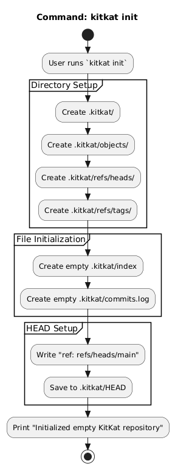
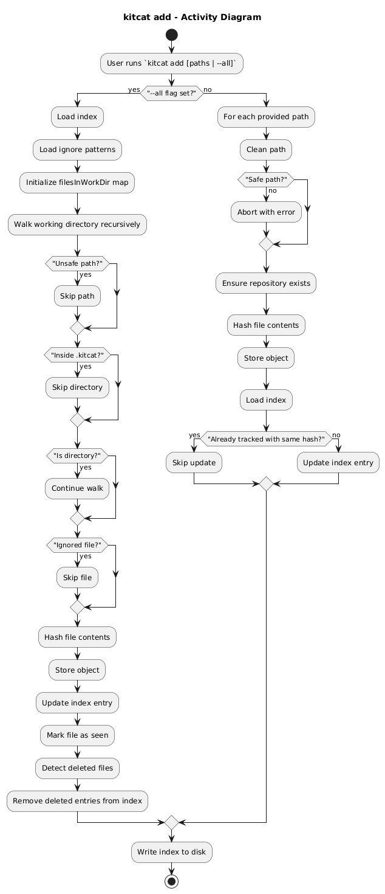
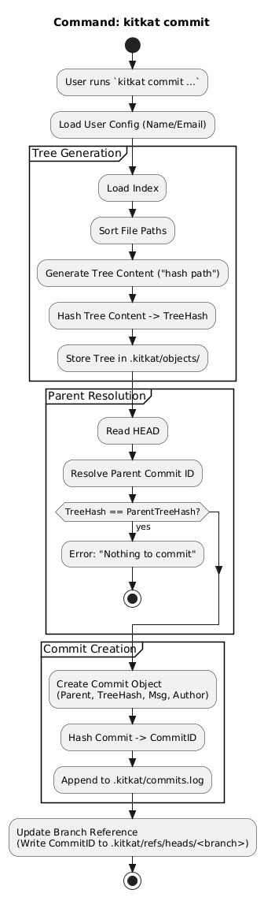
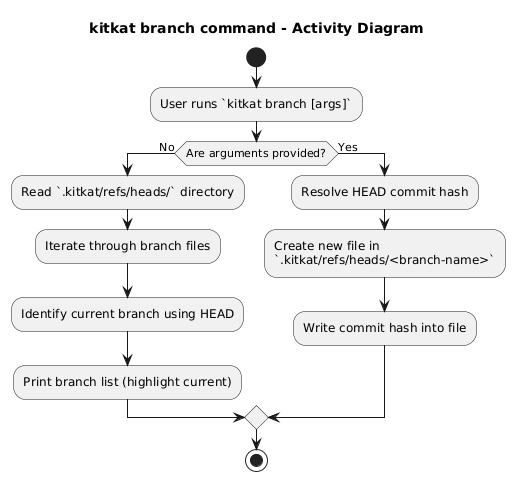

# KitKat Architecture & Design

This document details the internal design of KitKat.

## 1. Repository Initialization
Logic for creating a new repository structure (`.kitkat` folders, HEAD, etc.).

## 2. Staging Flow (Add)
Logic for moving files from the Working Directory to the Index (Staging Area).

## 3. Snapshot Flow (Commit)
Logic for creating a permanent snapshot from the Index.

## 4. Branch Command
Logic for listing existing branches and creating a new branch pointing to the current commit.

